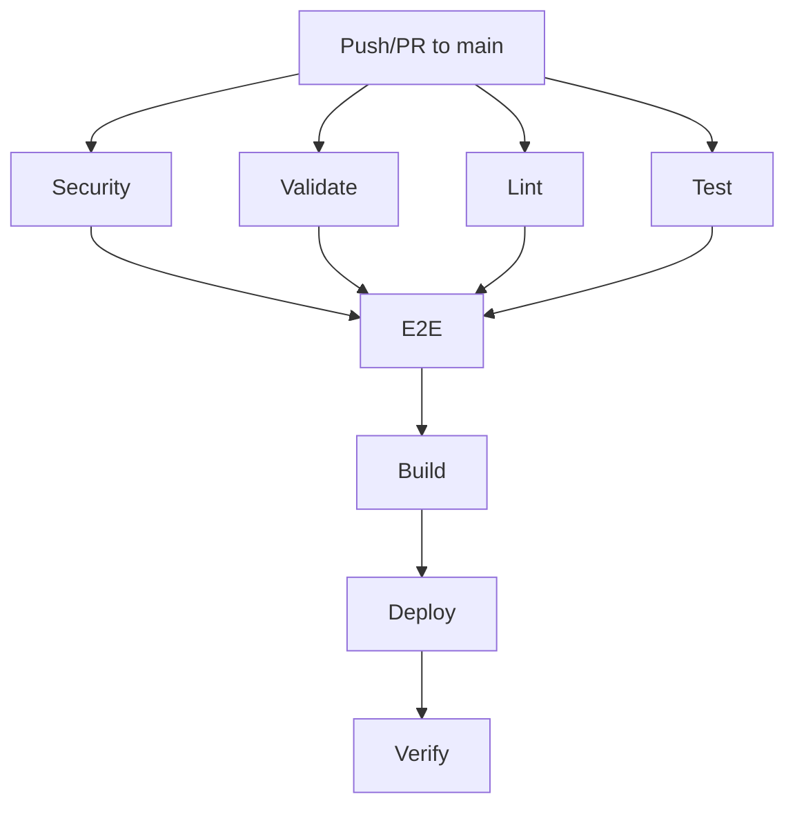

# CI/CD Documentation

This document describes the Continuous Integration and Continuous Deployment (CI/CD) setup for the openDesk Edu Website.

## 📋 Table of Contents

- [Overview](#-overview)
- [Workflows](#-workflows)
  - [CI Pipeline](#ci-pipeline)
  - [Artwork CI](#artwork-ci)
  - [Secret Scan](#secret-scan)
  - [Preview Deployments](#preview-deployments)
  - [Test Coverage](#test-coverage)
  - [Dependency Audit](#dependency-audit)
- [Features](#-features)
- [Runner Configuration](#-runner-configuration)
- [Environment Variables](#-environment-variables)
- [Troubleshooting](#-troubleshooting)
- [Best Practices](#-best-practices)

---

## 📊 Overview

The openDesk Edu Website uses **GitHub Actions** for CI/CD with the following principles:

- **Reliability**: Fallback runners and retry logic
- **Security**: Multiple scanning tools and dependency checks
- **Quality**: Comprehensive testing and validation
- **Performance**: Caching and parallel execution
- **Observability**: Artifacts, logs, and notifications

### Workflow Summary

| Workflow | File | Trigger | Purpose |
|----------|------|---------|---------|
| CI | `.github/workflows/ci.yml` | Push/PR to `main` | Main pipeline: lint, test, build, deploy |
| Artwork CI | `.github/workflows/artwork-ci.yml` | Push to `main` (SVG changes) | SVG validation, optimization, PNG export |
| Secret Scan | `.github/workflows/secret-scan.yml` | Push/PR to `main` | Gitleaks + TruffleHog secret detection |
| Preview | `.github/workflows/preview.yml` | PR opened/synchronized | PR preview deployments |
| Coverage | `.github/workflows/coverage.yml` | Push/PR to `main` | Test coverage tracking and reporting |
| Audit | `.github/workflows/audit.yml` | Weekly schedule + manual | Dependency security and updates |

---

## 🚀 Workflows

### CI Pipeline

**File**: `.github/workflows/ci.yml`

**Trigger**: Push or Pull Request to `main` branch

**Jobs**:



#### Job Details

| Job | Description | Dependencies | Runs On |
|-----|-------------|--------------|---------|
| **security** | npm audit + Gitleaks scan | None | self-hosted → ubuntu-latest |
| **validate** | Content, integration, env validation | None | self-hosted → ubuntu-latest |
| **lint** | ESLint + TypeScript type check | None | self-hosted → ubuntu-latest |
| **test** | Vitest unit tests | None | self-hosted → ubuntu-latest |
| **e2e** | Playwright E2E tests | lint, test | self-hosted → ubuntu-latest |
| **build** | Next.js production build | lint, test, e2e, validate, security | self-hosted → ubuntu-latest |
| **deploy** | Production deployment | build | self-hosted → ubuntu-latest |

#### Production Deployment

The deployment process:

1. **SSH Setup**: Writes deploy key and updates known_hosts
2. **Git Pull**: Updates repository on production server
3. **Docker Build**: Builds image with BuildKit support (with fallback)
4. **Docker Tag**: Tags image with commit SHA
5. **Docker Compose**: Restarts containers
6. **Health Check**: Verifies site is responding (HTTP 200)

**BuildKit Support**:
```bash
# Checks for BuildKit availability
if command -v docker buildx >/dev/null 2>&1; then
  DOCKER_BUILDKIT=1 docker compose build
elif docker version | grep -q "BuildKit"; then
  DOCKER_BUILDKIT=1 docker compose build
else
  docker compose build
fi
```

#### Health Verification

```bash
# Retry for 6 attempts with 5s intervals
for i in {1..6}; do
  STATUS=$(curl -s -o /dev/null -w "%{http_code}" https://opendesk-edu.org)
  if [ "$STATUS" = "200" ]; then
    echo "✅ Site is live (HTTP 200)"
    exit 0
  fi
  echo "⚠️  Attempt $i/6: Retrying in 5s..."
  sleep 5
done
echo "❌ Verification failed" && exit 1
```

---

### Artwork CI

**File**: `.github/workflows/artwork-ci.yml`

**Trigger**: Push to `main` with changes to `public/static/**/*.svg`

**Purpose**: Automatically validate, optimize, and regenerate artwork assets.

#### Steps:

1. **Checkout**: Get repository code
2. **Setup Node**: Install Node.js 20 with npm cache
3. **Restore Cache**: Load cached node_modules
4. **Install**: `npm ci` if cache miss
5. **Validate SVGs**: Run `npm run validate:svg`
6. **Check Palette**: Run `npm run check:palette`
7. **Optimize SVGs**: Run `npm run optimize:svg`
8. **Export PNGs**: Run `npm run export:png`
9. **Auto-commit**: Commit changes if files were modified

#### Cache Strategy:

- Uses GitHub Actions cache for `node_modules`
- Cache key: `os-node-hash(package-lock.json)`
- Restore keys: `os-node-` (fallback to any node cache)

---

### Secret Scan

**File**: `.github/workflows/secret-scan.yml`

**Trigger**: Push or Pull Request to `main`

**Purpose**: Detect accidentally committed secrets.

#### Tools:

1. **Gitleaks**: Fast, configurable secret detection
   - Scans entire git history
   - Uses custom configuration from `.gitleaks.toml`
   - Detects API keys, passwords, tokens, etc.

2. **TruffleHog**: Deep secret scanning
   - Scans current changes against base branch
   - Uses entropy and regex-based detection
   - Finds secrets in files and commit history

#### Notifications:

- **Slack**: Alerts sent to configured Slack webhook on secret detection
- **GitHub**: Workflow fails with detailed output

---

### Preview Deployments

**File**: `.github/workflows/preview.yml`

**Trigger**: Pull Request opened, synchronized, or reopened

**Purpose**: Provide preview deployments for PR review.

#### Features:

- Runs on PR changes
- Builds and validates PR branch
- Uploads build artifacts
- Sends Slack notification with preview status
- Cleanup notification on PR close

#### Future Enhancement:

Currently uploads build artifacts. Can be extended to deploy to:
- Vercel preview environments
- Netlify preview sites
- Custom preview infrastructure

---

### Test Coverage

**File**: `.github/workflows/coverage.yml`

**Trigger**: Push or Pull Request to `main`

**Purpose**: Track and report test coverage metrics.

#### Features:

- Runs Vitest with coverage flags
- Generates coverage reports in multiple formats
- Uploads to Codecov on main branch pushes
- Checks against minimum threshold (75%)
- Saves coverage artifacts for debugging

#### Coverage Reports:

- **Text**: Human-readable summary
- **JSON**: Machine-parsable results
- **LCOV**: Standard coverage format
- **HTML**: Visual coverage report

#### Threshold Check:

```bash
MIN_COVERAGE=75
LINES=$(jq '.total.lines.pct' coverage-summary.json)
if (( $(echo "$LINES < $MIN_COVERAGE" | bc -l) )); then
  echo "⚠️  Coverage below threshold (${LINES}% < ${MIN_COVERAGE}%)"
  exit 1
fi
```

---

### Dependency Audit

**File**: `.github/workflows/audit.yml`

**Trigger**: Weekly (Monday 2 AM UTC) + Manual

**Purpose**: Monitor dependency security and updates.

#### Jobs:

| Job | Description | Schedule |
|-----|-------------|----------|
| **audit** | npm audit for vulnerabilities | Weekly |
| **outdated** | Check for outdated dependencies | Weekly |

#### Audit Job:

- Runs `npm audit --audit-level=moderate`
- Fails if vulnerabilities found
- Uploads detailed audit report as artifact
- Sends Slack notification on detection

#### Outdated Job:

- Uses `npm-check-updates` to find outdated packages
- Reports all outdated packages
- Fails only if critical packages (next, react, typescript) are outdated
- Uploads detailed report as artifact

---

## ✨ Features

### Reliability

- **Runner Fallback**: All workflows use `[self-hosted, linux, ubuntu-latest]`
  - Prioritizes self-hosted runners
  - Falls back to GitHub-hosted if unavailable
  - Prevents complete CI/CD failure

- **Concurrency Control**: 
  - Prevents redundant workflow runs
  - Cancels in-progress runs for same branch
  - Reduces resource usage

- **Retry Logic**: Health checks retry multiple times before failing

### Security

- **Multi-Tool Scanning**: Gitleaks + TruffleHog for comprehensive coverage
- **Dependency Checking**: npm audit for vulnerability detection
- **Least Privilege**: Workflows have minimal required permissions
- **Secret Protection**: Never log sensitive information

### Quality

- **Multi-Stage Validation**: Content, SVG, palette, integration, environment
- **Comprehensive Testing**: Unit tests + E2E tests
- **Type Safety**: TypeScript type checking
- **Code Style**: ESLint with Next.js config

### Performance

- **Automatic Caching**: npm dependencies cached automatically
- **Manual Cache Fallback**: Explicit cache save/restore for edge cases
- **Parallel Execution**: Independent jobs run concurrently
- **Path Filtering**: Artwork workflow only runs on SVG changes

### Observability

- **Artifact Retention**: Build artifacts and test results saved
- **Workflow Badges**: Status badges in README
- **Detailed Output**: Verbose logging with emoji indicators
- **Slack Notifications**: Alerts for critical events

---

## 🏃 Runner Configuration

### Self-Hosted Runners

All workflows are configured to run on self-hosted runners with Ubuntu fallback:

```yaml
runs-on: [self-hosted, linux, ubuntu-latest]
```

This configuration means:
1. **First choice**: Self-hosted runners with `linux` label
2. **Fallback**: GitHub-hosted `ubuntu-latest` runners
3. **Failure handling**: If both are unavailable, workflow fails

### Self-Hosted Runner Requirements

To set up self-hosted runners for this repository:

1. **Hardware**:
   - Minimum 2 vCPUs
   - Minimum 4 GB RAM
   - Minimum 20 GB disk space

2. **Software**:
   - Ubuntu 20.04 or 22.04
   - Docker 20.10+
   - Node.js 20+
   - npm 9+

3. **Setup**:
   ```bash
   # Download runner
   mkdir actions-runner && cd actions-runner
   curl -o actions-runner-linux-x64-2.311.0.tar.gz -L https://github.com/actions/runner/releases/download/v2.311.0/actions-runner-linux-x64-2.311.0.tar.gz
   tar xzf ./actions-runner-linux-x64-2.311.0.tar.gz
   
   # Configure and run
   ./config.sh --url https://github.com/opendesk-edu/opendesk-edu-website --token YOUR_TOKEN
   ./run.sh
   ```

4. **Labels**:
   - Add `self-hosted` and `linux` labels
   - Optional: Add environment-specific labels (e.g., `prod`, `staging`)

---

## 🔐 Environment Variables

### Required Secrets

| Secret | Purpose | Used In |
|--------|---------|---------|
| `DEPLOY_SSH_KEY` | SSH private key for deployment | CI Pipeline |
| `DEPLOY_HOST` | Deployment server hostname | CI Pipeline |
| `DEPLOY_USER` | Deployment server username | CI Pipeline |
| `DEPLOY_PATH` | Deployment directory on server | CI Pipeline |
| `GITLEAKS_LICENSE` | Gitleaks Pro license (optional) | Secret Scan |
| `SLACK_WEBHOOK` | Slack webhook URL for notifications | All workflows |
| `CODECOV_TOKEN` | Codecov token for coverage upload | Coverage Workflow |

### GitHub Token

The `GITHUB_TOKEN` is automatically provided by GitHub Actions with `contents: read` permissions.

---

## 🐛 Troubleshooting

### Common Issues

#### 1. Workflow stuck on "Queued"

**Cause**: No self-hosted runner available, and GitHub-hosted not configured as fallback.

**Solution**: 
- Check self-hosted runner status
- Verify runner labels match workflow configuration
- Add `ubuntu-latest` to runner selection:
  ```yaml
  runs-on: [self-hosted, linux, ubuntu-latest]
  ```

#### 2. npm install taking too long

**Cause**: Missing cache or cache invalidation.

**Solution**:
- Verify cache configuration
- Clear cache manually:
  ```bash
  gh action cache delete --repo opendesk-edu/opendesk-edu-website --all
  ```
- Use automatic caching:
  ```yaml
  - uses: actions/setup-node@v4
    with:
      node-version: 20
      cache: npm
  ```

#### 3. Deployment verification failing

**Cause**: Site not responding within timeout.

**Solution**:
- Check site manually: `curl https://opendesk-edu.org`
- Verify Docker containers are running: `docker ps`
- Check logs: `docker compose logs`
- Increase timeout in verification script
- Check火 wall/firewall settings

#### 4. Secret scan false positives

**Cause**: Legitimate strings matching secret patterns.

**Solution**:
- Add exceptions to `.gitleaks.toml`
- Use allowlists for known safe patterns
- Review and commit false positives to baseline

#### 5. Cache not being used

**Cause**: Different cache keys between runs.

**Solution**:
- Use consistent cache key:
  ```yaml
  key: ${{ runner.os }}-node-${{ hashFiles('package-lock.json') }}
  ```
- Add restore keys for fallback:
  ```yaml
  restore-keys: |
    ${{ runner.os }}-node-
  ```

### Debugging Commands

```bash
# List workflow runs
gh run list --repo opendesk-edu/opendesk-edu-website

# View workflow run details
gh run view --repo opendesk-edu/opendesk-edu-website RUN_ID

# Download workflow artifacts
gh run download --repo opendesk-edu/opendesk-edu-website RUN_ID

# View workflow logs
gh run view --repo opendesk-edu/opendesk-edu-website RUN_ID --log

# Check cache usage
gh action cache list --repo opendesk-edu/opendesk-edu-website
```

---

## 📖 Best Practices

### For Contributors

1. **Always run validation locally**:
   ```bash
   npm run lint
   npm run typecheck
   npm run validate:content
   npm run check:integration
   ```

2. **Test before committing**:
   ```bash
   npm run test
   npm run test:e2e
   ```

3. **Keep PRs small**: Smaller PRs review and merge faster

4. **Update dependencies regularly**:
   ```bash
   npm update
   npm outdated
   ```

### For Maintainers

1. **Monitor CI/CD health**:
   - Check workflow runs regularly
   - Investigate failures promptly
   - Review flaky tests

2. **Keep dependencies updated**:
   - Run audit workflow weekly
   - Address vulnerabilities promptly
   - Update GitHub Actions regularly

3. **Maintain self-hosted runners**:
   - Monitor runner health
   - Update runner software
   - Scale runners based on load

4. **Review security alerts**:
   - Enable GitHub security alerts
   - Review secret scan results
   - Rotate exposed secrets immediately

5. **Optimize workflows**:
   - Review workflow durations
   - Identify bottlenecks
   - Add caching where missing
   - Parallelize independent jobs

---

## 📞 Support

For CI/CD-related issues:

1. Check this documentation
2. Review workflow logs
3. Search GitHub Actions documentation
4. Ask in project discussions
5. Open an issue with "area:ci" label

---

## 🔗 Resources

- [GitHub Actions Documentation](https://docs.github.com/en/actions)
- [Next.js Deployment Documentation](https://nextjs.org/docs/deployment)
- [Docker Documentation](https://docs.docker.com/)
- [Vitest Documentation](https://vitest.dev/)
- [Playwright Documentation](https://playwright.dev/)
- [Gitleaks Documentation](https://github.com/gitleaks/gitleaks)
- [TruffleHog Documentation](https://github.com/trufflesecurity/trufflehog)

---

*Last updated: July 25, 2026*
