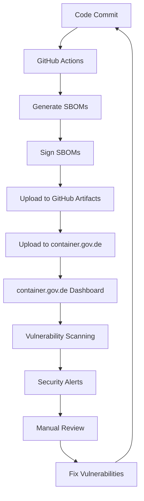

# container.gov.de Integration für openDesk Edu

## Overview

[container.gov.de](https://container.gov.de/) ist das offizielle Portal des Bundesamtes für Sicherheit in der Informationstechnik (BSI) für sichere Container-Images und Software Bill of Materials (SBOMs). Diese Anleitung beschreibt, wie openDesk Edu SBOMs auf container.gov.de veröffentlichen und so zur Transparenz und Sicherheit der europäischen Open-Source-Community beitragen kann.

## Why container.gov.de?

### Benefits for openDesk Edu

1. **Compliance & Trust**
   - Er erfüllt die Anforderungen der EU Cyber Resilience Act (CRA)
   - Erhöht das Vertrauen von öffentlichen Einrichtungen und Unternehmen
   - Zeigt Transparenz und Sicherheit nach

2. **Visibility & Discovery**
   - OpenDesk Edu wird in der offiziellen deutschen Container-Registry gelistet
   - Erhöht die Sichtbarkeit für deutsche und europäische Nutzende
   - Ermöglicht einfache Entdeckung durch Suchfunktionen

3. **Security & Vulnerability Management**
   - Automatisierte Vulnerability-Scans basierend auf den SBOMs
   - Benachrichtigungen bei neuen Sicherheitslücken in Abhängigkeiten
   - Integration mit anderen Sicherheitstools

4. **Collaboration with BSI**
   - Direkter Austausch mit dem BSI möglich
   - Unterstützung bei Sicherheitsfragen
   - Möglichkeit, an BSI-Initiativen teilzunehmen

## Registration Process

### Step 1: Account Registration

1. Gehe zu [https://container.gov.de/](https://container.gov.de/)
2. Klicke auf "Registrieren" in der oberen rechten Ecke
3. Wähle die passende Account-Art:
   - **Organisation** (empfohlen für openDesk Edu)
   - **Individual** (für persönliche Projekte)
4. Gib die erforderlichen Informationen ein:
   - Organisationsname: `openDesk Edu`
   - Organisationstyp: `Community/Open Source Project`
   - E-Mail-Adresse: `info@opendesk-edu.org` oder Projekt-E-Mail
   - Website: `https://opendesk-edu.org`
   - Beschreibung: Kurze Beschreibung des Projekts

5. **Verifizierung**
   - Du erhältst eine Verifizierungs-E-Mail
   - Bestätige deine E-Mail-Adresse
   - Für Organisations-Accounts: Üblicherweise wird eine Bestätigung der Domain-Inhaberschaft verlangt

### Step 2: Project Registration

Nach erfolgreicher Anmeldung:

1. Logge dich in dein Konto ein
2. Navigation: "My Projects" → "Add New Project"
3. Project Details:
   - **Project Name**: `openDesk Edu`
   - **Short Description**: `Open-source digital workplace for higher education`
   - **Long Description**: Ausführliche Beschreibung des Projekts
   - **Homepage**: `https://opendesk-edu.org`
   - **License**: `Apache-2.0`
   - **Repository URL**: `https://github.com/opendesk-edu/opendesk-edu-website`
   - **Primary Language**: `TypeScript/JavaScript/Go/Python` (je nach Komponente)

4. **Project Type**
   - Wähle "Application" oder "Platform"
   - Kategorien: Education, Collaboration, DevOps

### Step 3: SBOM Upload

#### Manual Upload via Web Interface

1. Gehe zu deinem Projekt
2. Klicke auf "Upload SBOM"
3. Wähle die SBOM-Datei (CycloneDX oder SPDX JSON)
4. Optional:
   - **Version**: z.B. `v1.0.0`
   - **Release Date**: Datum der Version
   - **Components**: Beschreibung der Hauptkomponenten
5. Klicke auf "Upload"

#### API Upload (empfohlen für Automatisierung)

container.gov.de bietet eine REST API für den automatisierten Upload:

```bash
# Beispiel mit curl
curl -X POST "https://api.container.gov.de/v1/projects/{project_id}/sboms" \
  -H "Authorization: Bearer {api_token}" \
  -H "Content-Type: application/json" \
  -F "sbom=@sbom-combined-cyclonedx.json" \
  -F "version=v1.0.0" \
  -F "format=cyclonedx"
```

**API-Token** kann im Dashboard unter "API Keys" generiert werden.

## SBOM Preparation for container.gov.de

### Requirements

- ✅ **Valid CycloneDX 1.4+ or SPDX 2.3+** format
- ✅ **Complete component information** (name, version, purl)
- ✅ **License information** for all components
- ✅ **Dependencies relationship** between components
- ⚠️ **Vulnerability information** (optional, aber empfohlen)
- ⚠️ **Signed SBOMs** (empfohlen für maximale Vertrauenswürdigkeit)

### Recommended SBOM Structure

```json
{
  "bomFormat": "CycloneDX",
  "specVersion": "1.5",
  "version": 1,
  "metadata": {
    "timestamp": "2026-08-01T00:00:00Z",
    "tools": [
      {"name": "cyclonedx-npm", "version": "1.17.0"},
      {"name": "cyclonedx-gomod", "version": "1.4.0"}
    ],
    "component": {
      "type": "application",
      "bom-ref": "opendesk-edu@1.0.0",
      "name": "openDesk Edu",
      "version": "1.0.0",
      "description": "Open-source digital workplace for higher education",
      "licenses": [{"license": {"id": "Apache-2.0"}}],
      "purl": "pkg:github/opendesk-edu/opendesk-edu-website@1.0.0",
      "externalReferences": [
        {
          "type": "website",
          "url": "https://opendesk-edu.org"
        },
        {
          "type": "vcs",
          "url": "https://github.com/opendesk-edu/opendesk-edu-website"
        }
      ]
    }
  },
  "components": [...],
  "dependencies": [...],
  "vulnerabilities": [...]
}
```

## SBOM Signing with Sigstore/Cosign

Um die Authentizität der SBOMs zu gewährleisten, sollten sie signiert werden.

### Installation

```bash
# Install cosign
curl -LO https://github.com/sigstore/cosign/releases/latest/download/cosign-linux-amd64
sudo mv cosign-linux-amd64 /usr/local/bin/cosign
chmod +x /usr/local/bin/cosign

# Verify installation
cosign version
```

### Generate Keypair

```bash
# Generate key pair
cosign generate-key-pair

# This creates:
# - cosign.key (private key)
# - cosign.pub (public key)
```

### Sign SBOM Files

```bash
# Sign a single SBOM file
cosign sign-blob --key cosign.key sbom-website-cyclonedx.json \
  --output-signature sbom-website-cyclonedx.json.sig \
  --output-certificate sbom-website-cyclonedx.json.cert

# Verify signature
cosign verify-blob --key cosign.pub --signature sbom-website-cyclonedx.json.sig sbom-website-cyclonedx.json
```

### Store Public Key on container.gov.de

1. Lade die öffentliche Schlüsseldatei (`cosign.pub`) hoch
2. Gehe zu "My Account" → "Signing Keys"
3. Klicke auf "Add Signing Key"
4. Wähle den Typ "Sigstore/Cosign" und lade die Datei hoch

## GitHub Actions Workflow Integration

See [`.github/workflows/sbom.yml`](/.github/workflows/sbom.yml) for the complete workflow that:

1. Generates SBOMs for all components
2. Signs them with cosign
3. Uploads to GitHub Artifacts
4. **Can be extended to upload to container.gov.de API**

### Extended Workflow for container.gov.de

```yaml
- name: Upload SBOM to container.gov.de
  if: inputs.upload-to-container-gov-de == 'true'
  env:
    CONTAINER_GOV_DE_API_TOKEN: ${{ secrets.CONTAINER_GOV_DE_API_TOKEN }}
    CONTAINER_GOV_DE_PROJECT_ID: ${{ secrets.CONTAINER_GOV_DE_PROJECT_ID }}
  run: |
    # Upload combined SBOM
    curl -X POST "https://api.container.gov.de/v1/projects/$CONTAINER_GOV_DE_PROJECT_ID/sboms" \
      -H "Authorization: Bearer $CONTAINER_GOV_DE_API_TOKEN" \
      -H "Content-Type: multipart/form-data" \
      -F "sbom=@sbom-combined-cyclonedx.json" \
      -F "version=${{ github.sha }}" \
      -F "format=cyclonedx" \
      -F "signature=@sbom-combined-cyclonedx.json.sig" \
      -F "certificate=@sbom-combined-cyclonedx.json.cert"
```

## Components to Publish on container.gov.de

### 1. openDesk Edu Website
- **Type**: Web Application
- **Language**: TypeScript, JavaScript
- **Dependencies**: Next.js, React, Tailwind CSS, etc.
- **SBOM Format**: CycloneDX (empfohlen)
- **Update Frequency**: Bei jedem Release

### 2. openDesk Dev Agent Operator
- **Type**: Kubernetes Operator
- **Language**: Go
- **Dependencies**: controller-runtime, Kubernetes APIs, etc.
- **SBOM Format**: CycloneDX
- **Update Frequency**: Bei jedem Release

### 3. k8up Backup Operator
- **Type**: Kubernetes Operator
- **Language**: Go
- **Dependencies**: Various Go libraries, restic
- **SBOM Format**: CycloneDX
- **Update Frequency**: Bei jedem Release

### 4. User Import Tools
- **Type**: CLI Application
- **Language**: Python
- **Dependencies**: Various Python libraries
- **SBOM Format**: CycloneDX
- **Update Frequency**: Bei jeden Release

### 5. Helm Charts
- **Type**: Kubernetes Application Package
- **Format**: YAML + Templates
- **Dependencies**: Sub-charts, container images
- **SBOM Format**: CycloneDX mit purl für Helm Charts
- **Update Frequency**: Bei jedem Chart Update

## Best Practices for container.gov.de

### 1. **Regular Updates**
- Aktualisiere SBOMs bei jedem Release
- Mindestens monatliche Updates für aktive Projekte
- Nutze Versionsnummern, die mit den Git-Tags harmonieren

### 2. **Complete Information**
- Fülle alle möglichen Felder in den SBOMs aus
- Gib korrekte purls (Package URLs) an
- Dokumentiere alle Lizenzen

### 3. **Security Scanning**
- Scanne SBOMs regelmäßig auf Vulnerabilities (z.B. mit Grype)
- Reagiere schnell auf Sicherheitsmeldungen
- Nutze die container.gov.de Vulnerability-Dashboard

### 4. **Access Control**
- Verwende API-Tokens mit begrenzten Rechten
- Rotate Tokens regelmäßig
- Nutze GitHub Secrets für sichere Speicherung

### 5. **Documentation**
- Dokumentiere den SBOM-Generierungsprozess
- Beschreibe, welche Komponenten enthalten sind
- Halte eine Changelog der SBOM-Versionen

## Example: Complete SBOM Pipeline



## Contact & Support

### container.gov.de Support
- **Website**: [https://container.gov.de/](https://container.gov.de/)
- **Documentation**: [https://container.gov.de/docs](https://container.gov.de/docs)
- **API Documentation**: [https://container.gov.de/api](https://container.gov.de/api)
- **Email**: support@container.gov.de

### BSI Contact
- **General**: [https://www.bsi.bund.de/](https://www.bsi.bund.de/)
- **Certification**: The BSI offers certification services for security-critical applications

## Contribution to container.gov.de Community

Neben der Publikation unserer eigenen SBOMs können wir auch:

1. **Feedback geben** zur Plattform
2. **Bug Reports** einreichen
3. **Feature Requests** stellen
4. **Dokumentation verbessern** (Pull Requests)
5. **Community-Diskussionen** teilnehmen

## Compliance & Standards

### Supported Standards
- ✅ **CycloneDX 1.4+**
- ✅ **SPDX 2.3+**
- ✅ **SWID Tags** (optional)
- ✅ **CPE** (Common Platform Enumeration)
- ✅ **purl** (Package URL)

### Compliance Frameworks
- ✅ **EU Cyber Resilience Act (CRA)**
- ✅ **ISO/IEC 5962:2021** (IT Security techniques - SBOM)
- ✅ **NIST SP 800-218** (Secure Software Development Framework)
- ✅ **NIST SSDF**

## Next Steps for openDesk Edu

1. **[ ] Account auf container.gov.de registrieren**
2. **[ ] Projekt "openDesk Edu" anlegen**
3. **[ ] SBOM-Generierungsworkflow testen** (`.github/workflows/sbom.yml`)
4. **[ ] SBOMs signieren** (cosign) und uploaden
5. **[ ] Regelmäßige SBOM-Updates einrichten**
6. **[ ] Vulnerability Monitoring aktivieren**
7. **[ ] Dokumentation vervollständigen**

## References

- [container.gov.de Official Website](https://container.gov.de/)
- [CycloneDX Specification](https://cyclonedx.org/specification/)
- [SPDX Specification](https://spdx.github.io/spdx-spec/)
- [Sigstore Documentation](https://docs.sigstore.dev/)
- [NIST SBOM Guidelines](https://www.nist.gov/itl/executive-leadership/software-supply-chain-security-guidance)
- [EU Cyber Resilience Act](https://digital-strategy.ec.europa.eu/en/policies/cyber-resilience-act)

---

*Document Version: 1.0.0*  
*Last Updated: 2026-08-01*  
*Maintainer: openDesk Edu Team*  
*License: Apache-2.0*
