# SBOM (Software Bill of Materials) für openDesk Edu

## Overview

Dieses Verzeichnis enthält alle Ressourcen für die Generierung, Verwaltung und Veröffentlichung von **Software Bill of Materials (SBOMs)** für das openDesk Edu-Projekt. SBOMs sind maschinell lesbare Inventarlisten aller Komponenten, Bibliotheken und Abhängigkeiten, die in einem Softwareprojekt verwendet werden.

## Why SBOM?

### Compliance
- **EU Cyber Resilience Act (CRA)** - Verpflichtend für Open-Source-Projekte, die in der EU genutzt werden
- **ISO/IEC 5962:2021** - Internationaler Standard für SBOM
- **NIST SP 800-218** - US-Regierungsspezifikationen für Software Supply Chain Security
- **BSI Empfehlungen** - Bundesamt für Sicherheit in der Informationstechnik

### Security
- **Transparenz** - Volle Übersicht über alle verwendeten Komponenten
- **Vulnerability Management** - Automatisierte Erkennung von Sicherheitslücken
- **Supply Chain Security** - Schutz vor bösartigen Abhängigkeiten
- **Incident Response** - Schnellere Reaktion auf Sicherheitsvorfälle

### Trust
- **Nachweisbare Sicherheit** für Nutzer:innen und Organisationen
- **Anerkennung durch öffentliche Einrichtungen**
- **Aufbau von Vertrauen in Open-Source-Software**

##struktur

```
docs/sbom/
├── README.md                    # Diese Datei
├── CONTAINER_GOV_DE_INTEGRATION.md  # Anleitung für container.gov.de
├── STANDARDS_COMPLIANCE.md       # Compliance mit Standards
└── EXAMPLES/                     # Beispiel-SBOMs (wird generiert)

.github/workflows/
└── sbom.yml                    # GitHub Actions Workflow

scripts/
└── generate-sbom.sh            # SBOM-Generierungsskript

sbom-output/                    # Generierte SBOMs (wird nicht committed)
```

## Supported Components

| Komponente | Sprache | SBOM Tool | Format |
|------------|---------|-----------|--------|
| Website | TypeScript/Node.js | `@cyclonedx/cyclonedx-npm` | CycloneDX, SPDX |
| Dev Agent Operator | Go | `cyclonedx-gomod` | CycloneDX, SPDX |
| k8up Operator | Go | `cyclonedx-gomod` | CycloneDX, SPDX |
| User Import Tools | Python | `cyclonedx-bom` | CycloneDX, SPDX |
| Helm Charts | YAML | Custom Generator | CycloneDX, SPDX |
| Nix Files | Nix | `syft` | CycloneDX, SPDX |

## Formats

### CycloneDX 1.5
- **Empfohlenes Format** für container.gov.de
- Leichtgewichtig und leicht zu parsing
- Unterstützt alle wichtigen Metallichen
- Standardformat für Supply Chain Security

### SPDX 2.3
- Linux Foundation Standard
- Umfassende Lizenzinformationen
- Weit verbreitet in der Open-Source-Community
- Unterstützt komplexe Lizenzausdrücke

## Usage

### Option 1: GitHub Actions Workflow (Empfohlen)

Manuellen Workflow ausführen:

```yaml
# .github/workflows/sbom.yml
# Kann manuell über GitHub UI getriggert werden:
# https://github.com/opendesk-edu/opendesk-edu-website/actions/workflows/sbom.yml
```

**Manueller Trigger:**
1. Gehe zu **Actions** Tab in GitHub
2. Wähle den **Generate SBOM** Workflow
3. Klicke auf **Run workflow**
4. Wähle die gewünschten Optionen:
   - **Format**: cyclonedx, spdx, oder both
   - **Components**: all, website, operator, python-tools, helm-charts, k8up
   - **Output Directory**: (optional, default: sbom-output)

### Option 2: Lokale Generierung mit Skript

```bash
# Alle Komponenten, beide Formate
./scripts/generate-sbom.sh both sbom-output

# Nur CycloneDX für die Website
./scripts/generate-sbom.sh cyclonedx sbom-website

# Nur SPDX für alle Komponenten
./scripts/generate-sbom.sh spdx sbom-all
```

**Voraussetzungen:**
- Node.js 18+
- Go 1.20+
- Python 3.10+
- Internetverbindung für Tool-Installation

### Option 3: Docker-basierte Generierung

```bash
# SBOM mit Docker generieren
docker run --rm -v $(pwd):/workspace -w /workspace \
  ghcr.io/opendesk-edu/sbom-generator:latest \
  ./scripts/generate-sbom.sh both /workspace/sbom-output
```

## SBOM Signierung

Um die **Authentizität und Integrität** der SBOMs zu gewährleisten, sollten sie **digital signiert** werden.

### mit Sigstore/Cosign

```bash
# 1. Cosign installieren
curl -LO https://github.com/sigstore/cosign/releases/latest/download/cosign-linux-amd64
sudo mv cosign-linux-amd64 /usr/local/bin/cosign
chmod +x /usr/local/bin/cosign

# 2. Schlüsselpaar generieren
cosign generate-key-pair
# Erzeugt: cosign.key (privat), cosign.pub (öffentlich)

# 3. SBOM signieren
cosign sign-blob --key cosign.key sbom-website-cyclonedx.json \
  --output-signature sbom-website-cyclonedx.json.sig \
  --output-certificate sbom-website-cyclonedx.json.cert

# 4. Signatur überprüfen
cosign verify-blob --key cosign.pub \
  --signature sbom-website-cyclonedx.json.sig \
  sbom-website-cyclonedx.json
```

### Schlüssel auf container.gov.de hinterlegen

1. Lade die öffentliche Schlüsseldatei (`cosign.pub`) auf [container.gov.de](https://container.gov.de/) hoch
2. Navigiere zu "My Account" → "Signing Keys"
3. Klicke auf "Add Signing Key"
4. Wähle "Sigstore/Cosign" und lade die Datei hoch

## container.gov.de Integration

siehe [CONTAINER_GOV_DE_INTEGRATION.md](CONTAINER_GOV_DE_INTEGRATION.md) für detaillierte Anleitung.

### Kurzanleitung

```bash
# 1. Projekt auf container.gov.de registrieren
#    https://container.gov.de/projects/add

# 2. API-Token generieren
#    https://container.gov.de/account/api-tokens

# 3. SBOM hochladen
curl -X POST "https://api.container.gov.de/v1/projects/YOUR_PROJECT_ID/sboms" \
  -H "Authorization: Bearer YOUR_API_TOKEN" \
  -H "Content-Type: multipart/form-data" \
  -F "sbom=@sbom-combined-cyclonedx.json" \
  -F "version=$(git describe --tags)" \
  -F "format=cyclonedx" \
  -F "signature=@sbom-combined-cyclonedx.json.sig" \
  -F "certificate=@sbom-combined-cyclonedx.json.cert"
```

## Best Practices

### 1. Regelmäßige Updates
- ✅ SBOMs bei jedem Release aktualisieren
- ✅ Mindestens monatlich für aktive Projekte
- ✅ Automatische Generierung in CI/CD integrieren

### 2. Vollständige Informationen
- ✅ Alle Komponenten mit korrekten Versionen
- ✅ Lizenzen für jede Komponente
- ✅ korrekte Package URLs (purls)
- ✅abhängigkeiten zwischen Komponenten

### 3. Sicherheit
- ✅ Signierte SBOMs verwenden
- ✅ API-Tokens sicher speichern (GitHub Secrets)
- ✅ Regelmäßig auf Vulnerabilities scannen

### 4. Dokumentation
- ✅ SBOM-Generierungsprozess dokumentieren
- ✅ Changelog der SBOM-Versionen führen
- ✅ Komponenten und deren Zwecke beschreiben

## Vulnerability Scanning

### mit Grype

```bash
# Grype installieren
curl -sSfL https://raw.githubusercontent.com/anchore/grype/main/install.sh | sh -s -- -b /usr/local/bin

# SBOM scannen
grype sbom:sbom-website-cyclonedx.json -o table

# Oder direkt Verzeichnis scannen
grype dir:opendesk-edu-website -o cyclonedx-json > vulnerabilities.json
```

### mit Trivy

```bash
# Trivy installieren
curl -sfL https://raw.githubusercontent.com/aquasecurity/trivy/main/contrib/install.sh | sh -s -- -b /usr/local/bin

# SBOM scannen
trivy sbom sbom-website-cyclonedx.json
```

### mit Dependency-Track

1. Dependency-Track installieren
2. SBOM hochladen
3. Automatische Vulnerability-Detection

## CUXFlow

```mermaid
graph LR
    A[Code Commit] -->|Trigger| B[Generate SBOM]
    B --> C[Sign SBOM]
    C --> D[Upload to Artifacts]
    D --> E[Upload to container.gov.de]
    E --> F[container.gov.de Dashboard]
    F --> G[Vulnerability Scanning]
    G --> H[Security Alerts]
    H --> I[Manual Review]
    I -->|Fix| J[Code Changes]
    J --> A
    
    style A fill:#f9f,stroke:#333
    style B fill:#bbf,stroke:#333
    style C fill:#bbf,stroke:#333
    style D fill:#9f9,stroke:#333
    style E fill:#9f9,stroke:#333
    style F fill:#ff9,stroke:#333
    style G fill:#ff9,stroke:#333
    style H fill:#f99,stroke:#333
```



## Examples

### Beispiel CycloneDX SBOM (Ausschnitt)

```json
{
  "bomFormat": "CycloneDX",
  "specVersion": "1.5",
  "version": 1,
  "metadata": {
    "timestamp": "2026-08-01T00:00:00Z",
    "tools": [{"name": "cyclonedx-npm", "version": "1.17.0"}],
    "component": {
      "type": "application",
      "bom-ref": "opendesk-edu-website@1.0.0",
      "name": "openDesk Edu Website",
      "version": "1.0.0",
      "description": "Official website for openDesk Edu",
      "licenses": [{"license": {"id": "Apache-2.0"}}],
      "purl": "pkg:github/opendesk-edu/opendesk-edu-website@1.0.0",
      "externalReferences": [
        {"type": "website", "url": "https://opendesk-edu.org"},
        {"type": "vcs", "url": "https://github.com/opendesk-edu/opendesk-edu-website"}
      ]
    }
  },
  "components": [
    {
      "type": "library",
      "bom-ref": "pkg:npm/next@16.2.12",
      "name": "next",
      "version": "16.2.12",
      "description": "The React Framework",
      "licenses": [{"license": {"id": "MIT"}}],
      "purl": "pkg:npm/next@16.2.12",
      "externalReferences": [
        {"type": "website", "url": "https://nextjs.org"}
      ]
    }
  ],
  "dependencies": []
}
```

### Beispiel SPDX SBOM (Ausschnitt)

```json
{
  "spdxVersion": "SPDX-2.3",
  "dataLicense": "CC0-1.0",
  "SPDXID": "SPDXRef-DOCUMENT",
  "name": "opendesk-edu-website